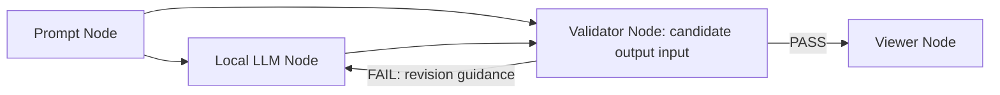

# Local LLM Node Lab

로컬 LLM을 노드 그래프로 조립하고 실행하는 **경량 연구용 워크플로우 시스템**입니다.  
이 프로젝트의 목적은 제품 기능을 많이 넣는 것이 아니라, 로컬 모델 호출을 시각적 그래프 구조로 추상화했을 때 다음 문제가 얼마나 명확하게 해결되는지 검증하는 데 있습니다.

1. 프롬프트 실험 과정을 재현 가능한 구조로 표현할 수 있는가
2. 생성 결과를 단순 출력에서 끝내지 않고, 별도 검증 단계로 분리할 수 있는가
3. 연결 그래프를 기반으로 실행 순서를 자동 계산할 수 있는가
4. 로컬 모델 환경에서도 최소한의 저장, 추적, 다국어 상호작용을 제공할 수 있는가

현재 구현은 `Prompt -> Local LLM -> Validator -> Viewer` 흐름을 기본 실험 단위로 삼습니다. `Validator`는 원본 프롬프트와 생성 결과를 동시에 입력받아, 요구사항 적합성·논리적 결함·수정 필요성을 별도 모델 호출로 평가합니다. 검증이 `FAIL`이면 수정 지시를 다시 생성 모델에 전달하고, 제한된 횟수 안에서 재생성·재검증을 반복한 뒤 `PASS`한 최종 답변만 `Viewer`로 전달합니다.

---

## Abstract

대형 언어 모델을 활용한 실험은 보통 하나의 긴 프롬프트 문자열, 수동 복사, 반복 실행에 의존한다. 이 방식은 단기 실험에는 빠르지만, 프롬프트가 길어지고 중간 처리 단계가 늘어날수록 재현성과 관찰 가능성이 급격히 낮아진다. `Local LLM Node Lab`은 이 문제를 완전한 제품이 아닌 **연구 프로토타입** 수준에서 해결하기 위해, 각 실험 단계를 독립 노드로 분리하고 그래프 실행 엔진으로 연결한다.

본 구현은 다음 네 가지를 핵심 기여로 둔다.

- **그래프 기반 실행 모델**: DAG(Directed Acyclic Graph)를 기반으로 실행 순서를 계산
- **출력 지향 실행 범위 축소**: 최종 출력 노드에서 역방향으로 도달 가능한 노드만 실행
- **이중 입력 검증 노드**: 원본 지시와 생성 결과를 분리 입력해 평가
- **검증 기반 재작성 루프**: 실패 시 수정 지시를 반영해 재생성 후 재검증
- **로컬 우선 구조**: 외부 클라우드 의존 없이 Ollama HTTP API를 통해 로컬 모델과 연동

그 결과, 단일 프롬프트 중심의 실험을 더 작은 구성 요소로 분해할 수 있고, 생성과 검증을 분리하여 결과 해석의 투명성을 높일 수 있다.

---

## Research Questions

이 프로젝트는 아래 질문을 검토하기 위한 실험 구현이다.

1. **시각적 그래프가 프롬프트 실험의 구조를 더 명확하게 만드는가**
2. **중간 결과와 최종 결과를 분리하면 실험 재현성이 높아지는가**
3. **생성 노드와 검증 노드를 분리하면 평가 품질을 향상시킬 수 있는가**
4. **불필요한 고립 노드를 실행하지 않는 선택적 실행 전략이 실제 사용성을 높이는가**
5. **로컬 LLM 환경에서도 다국어 인터페이스와 실험 관리가 가능한가**

---

## Core Workflow



기본 플로우는 네 단계로 구성된다.

1. `Prompt Node`
   - 사용자의 원본 지시를 보관한다.
2. `Local LLM Node`
   - Ollama를 통해 로컬 모델을 호출해 초안 결과를 생성한다.
3. `Validator Node`
   - 원본 프롬프트와 생성 결과를 동시에 비교한다.
   - 요구 충족 여부, 누락 조건, 논리적 모순, 수정 권고를 생성한다.
   - 실패 시 수정 지시를 생성 노드로 되돌려 재작성을 유도한다.
4. `Viewer Node`
   - 최종적으로 관찰할 결과를 표시한다.

이 구조는 단순 생성보다 **생성-검증 분리**가 중요하다는 점을 보여 주기 위해 선택했다.

---

## Features

### Implemented

- 노드 기반 워크플로우 편집
- `Prompt`, `Local LLM`, `Validator`, `Viewer` 노드
- React Flow 기반 연결선 생성 및 삭제
- 선택한 선 삭제 버튼, 더블클릭 삭제, `Delete` / `Backspace` 삭제
- Ollama 로컬 모델 목록 조회
- 저장된 플로우 저장 및 불러오기
- 실행 로그와 최종 결과 분리 출력
- 검증 실패 시 재작성 루프와 반복 회차 로그
- 한국어 / English / 日本語 UI
- 검증 결과 언어도 선택 언어에 맞춰 생성
- 포트 충돌을 피하는 Windows 실행 배치 파일

### Intentionally Excluded

- 채팅방 중심 UX
- 문서 내보내기
- 다중 승인 단계
- 대규모 커스텀 노드 생태계
- 권한 관리, 사용자 계정, 배포 자동화

이 제외 항목들은 누락이 아니라 설계 의도다. 본 프로젝트는 기능 수보다 **구조적 개념 검증**에 초점을 둔다.

---

## System Architecture

```text
local-llm-node-lab/
  backend/
    app/
      engine.py          # 그래프 실행 엔진
      main.py            # FastAPI 엔드포인트
      models.py          # 요청/응답 데이터 모델
      ollama_client.py   # Ollama HTTP 클라이언트
      storage.py         # JSON 플로우 저장소
    requirements.txt
  frontend/
    src/
      App.jsx            # 전체 UI 상태와 실행 흐름
      CustomNode.jsx     # 노드 시각 표현
      defaultFlow.js     # 기본 연구 플로우
      styles.css
  start-dev.bat
```

### Backend Responsibilities

- 그래프 유효성 검증
- 실행 대상 노드 계산
- 위상 정렬
- 노드 타입별 실행 분기
- Ollama 호출
- 플로우 저장/불러오기

### Frontend Responsibilities

- 그래프 편집
- 노드 속성 편집
- 선 선택 및 삭제
- 모델 선택
- 다국어 UI
- 실행 로그 렌더링
- 저장된 플로우 관리

---

## Algorithms and Logic

## 1. Output-Reachable Active Subgraph Selection

### Problem

사용자는 실험 중 임시 노드를 추가하거나 아직 연결하지 않은 노드를 남겨 둘 수 있다. 모든 노드를 무조건 실행하면, 실제 출력 경로와 무관한 빈 노드 때문에 전체 실험이 실패할 수 있다.

### Implementation

[`backend/app/engine.py`](./backend/app/engine.py)의 `_active_node_ids()`는 `Viewer` 노드에서 시작해 역방향 간선을 따라가며 도달 가능한 노드만 활성 집합으로 만든다.

```python
viewer_ids = {
    node.id
    for node in flow.nodes
    if node.data.get("nodeType") == "viewer"
}

reverse_edges = defaultdict(list)
for edge in flow.edges:
    reverse_edges[edge.target].append(edge.source)
```

이후 BFS 방식으로 upstream 노드를 확장한다.

### Why This Matters

- 고립된 실험 노드를 실행 범위에서 제외
- 연구 중간 상태의 그래프도 실행 가능
- 실제 관찰 대상과 무관한 실패를 줄임

### Complexity

- 시간 복잡도: `O(V + E)`
- 공간 복잡도: `O(V + E)`

---

## 2. Topological Sorting with Cycle Detection

### Problem

그래프는 사용자가 자유롭게 연결할 수 있으므로, 실행 순서를 자동으로 계산해야 한다. 순환이 생기면 정상적인 선형 실행 순서가 존재하지 않는다.

### Implementation

`_topological_order()`는 Kahn 알고리즘을 사용한다.

```python
indegree = {node_id: 0 for node_id in node_ids}
...
queue = deque(node_id for node_id, degree in indegree.items() if degree == 0)
```

간선을 순회하며 진입 차수를 줄이고, 끝까지 처리되지 않은 노드가 남으면 순환으로 판단한다.

```python
if len(order) != len(node_ids):
    raise ValueError("Flow contains a cycle.")
```

### Why This Matters

- 사용자가 순서를 직접 지정하지 않아도 됨
- 연결 그래프 자체가 실행 규칙이 됨
- 순환 구조를 조기에 감지해 실패 원인을 명확히 제시

### Complexity

- 시간 복잡도: `O(V + E)`
- 공간 복잡도: `O(V + E)`

---

## 3. Handle-Aware Input Routing

### Problem

단일 입력만 받는 노드는 upstream 출력 하나만 이어 받으면 된다. 하지만 `Validator`는 서로 다른 의미의 입력 두 개가 필요하다.

1. 원본 프롬프트
2. 생성 후보 결과

둘을 섞으면 검증의 의미가 무너진다.

### Implementation

프론트엔드 기본 플로우는 서로 다른 `targetHandle`을 사용한다.

```javascript
{
  source: "prompt-1",
  target: "validator-1",
  targetHandle: "prompt",
}
{
  source: "llm-1",
  target: "validator-1",
  targetHandle: "candidate",
}
```

백엔드는 실행 시 `targetHandle`로 입력을 분리한다.

```python
prompt_values = [
    outputs[edge.source]
    for edge in incoming_edges[node_id]
    if edge.source in outputs and edge.targetHandle == "prompt"
]
candidate_values = [
    outputs[edge.source]
    for edge in incoming_edges[node_id]
    if edge.source in outputs and edge.targetHandle == "candidate"
]
```

### Why This Matters

- 검증 노드의 의미론이 명확해짐
- 노드 확장 시 다중 입력 패턴을 재사용 가능
- 단순한 텍스트 파이프라인이 아니라 **역할 기반 데이터 흐름**을 표현 가능

---

## 4. Validator Prompt Template

### Problem

LLM이 생성한 결과를 같은 수준의 자유 형식 텍스트로만 평가하면, 실험자가 비교하기 어렵다.

### Implementation

`_validator_prompt()`는 검증 결과 형식을 강제한다.

```text
- Verdict: PASS or FAIL
- Requirement fit
- Logical review
- Issues
- Revision guidance
```

또한 응답 언어를 `Korean`, `English`, `Japanese` 중 하나로 지정한다.

### Why This Matters

- 결과 비교가 쉬움
- 프롬프트 충족 여부와 논리 품질을 분리해서 볼 수 있음
- 향후 점수화, 자동 리포팅, 재시도 정책으로 확장하기 쉬움

---

## 5. Validation-Guided Revision Loop

### Problem

검증 노드가 단순 평가문만 출력하면, 사용자는 결국 수정 지시를 직접 복사해 다시 생성 노드에 넣어야 한다. 이 경우 생성-검증 분리는 되었지만 자동화된 품질 개선은 일어나지 않는다.

### Implementation

현재 엔진은 `Validator`가 `FAIL`을 반환하면, 검증 결과 전체를 `_revision_prompt()`에 포함해 생성 모델에 다시 전달한다. 이후 새 후보를 재검증한다. 이 루프는 최대 3회까지 반복된다.

```python
for attempt in range(1, max_attempts + 1):
    latest_validation = generate(...)
    latest_verdict = _parse_verdict(latest_validation)

    if latest_verdict == "PASS":
        return current_candidate, latest_validation, latest_verdict

    if attempt < max_attempts:
        current_candidate = generate(
            prompt=_revision_prompt(source_prompt, current_candidate, latest_validation),
            ...
        )
```

### Why This Matters

- 사용자가 수동으로 수정 지시를 복사하지 않아도 됨
- 검증 결과가 실제 품질 개선 행동으로 이어짐
- 최종 출력에는 검증 문구가 아니라 통과한 답변만 남음
- 실행 로그에는 각 시도 회차와 판정이 남아 실험 추적이 가능

---

## 6. Local LLM Integration via Ollama HTTP API

### Problem

연구 목적상 클라우드 API보다 로컬 모델을 직접 연결해야 한다.

### Implementation

[`backend/app/ollama_client.py`](./backend/app/ollama_client.py)는 Python 표준 라이브러리의 `urllib`만 사용해 Ollama와 통신한다.

- `/api/tags`: 로컬 모델 목록 조회
- `/api/generate`: 텍스트 생성 요청

### Why This Matters

- 외부 벤더 SDK 의존 최소화
- 로컬 모델 교체가 쉬움
- 연구 결과가 네트워크 정책이나 API 키에 덜 의존

---

## 7. UI Localization Strategy

### Problem

연구용 도구라도 사용 언어가 바뀌면 조작 부담이 커진다. 또한 검증 결과도 사용자의 언어와 일치해야 해석 비용이 낮아진다.

### Implementation

[`frontend/src/App.jsx`](./frontend/src/App.jsx)는 문자열 사전을 직접 들고 있으며, `language` 상태에 따라 UI 텍스트와 기본 노드 라벨을 갱신한다.

```javascript
const translations = {
  en: { ... },
  ko: { ... },
  ja: { ... },
};
```

동시에 백엔드 실행 요청에 `language`를 포함해 `Validator`의 결과 언어도 동기화한다.

### Why This Matters

- UI와 모델 응답 언어의 불일치를 줄임
- 연구 참여자나 발표 대상이 달라도 같은 구조를 재사용 가능
- 국제화 프레임워크 없이도 작은 실험에서는 충분히 검증 가능

---

## Code Review Notes

아래는 현재 구현을 코드 리뷰 관점에서 해석한 내용이다.

### Strengths

1. **작은 시스템 경계**
   - 핵심 책임이 `engine`, `ollama_client`, `storage`, `UI`로 잘 분리돼 있다.
   - 실험 목적에 비해 과도한 추상화가 없다.

2. **실행 실패가 명시적**
   - 빈 프롬프트, 모델 미선택, 검증 입력 누락, 순환 그래프를 각각 다른 오류로 표현한다.
   - 연구 과정에서 실패 원인을 추적하기 쉽다.

3. **검증 노드의 입력 의미가 코드에 드러남**
   - `prompt`와 `candidate`가 단순 배열 순서가 아니라 핸들 이름으로 구분된다.
   - 이 설계는 유지보수성과 설명 가능성 모두에 유리하다.

4. **프론트엔드가 그래프 편집과 실행 결과를 분리**
   - 캔버스, 인스펙터, 결과 패널이 역할별로 나뉘어 있다.
   - 도구형 인터페이스에 맞는 정보 구조다.

5. **로컬 모델 기반 연구에 적합**
   - Ollama만 있으면 모델 교체 실험이 가능하다.
   - 외부 API 호출 비용과 키 관리 문제를 피한다.

### Current Limitations

1. **검증은 여전히 LLM 기반 평가**
   - Validator 역시 생성 모델이므로 절대적 진실 판별기는 아니다.
   - 논리적 결함 탐지 품질은 선택 모델 성능에 의존한다.

2. **플로우 저장소가 JSON 파일 단일 구조**
   - 개인 연구에는 충분하지만 동시 편집, 버전 관리, 충돌 해결에는 약하다.

3. **검증 결과가 아직 구조화 객체가 아님**
   - 현재는 텍스트 출력이다.
   - `verdict`, `issues`, `revision_guidance`를 JSON 스키마로 강제하면 후처리가 더 쉬워진다.

4. **UI 다국어는 경량 구현**
   - 작은 프로젝트에는 충분하지만, 대규모 확장에는 전문 i18n 라이브러리가 더 적합하다.

5. **현재 엔진은 비동기 병렬 실행을 하지 않음**
   - 그래프가 커져도 순차 실행한다.
   - 연구용 단순성에는 맞지만, 대형 워크플로우 성능에는 한계가 있다.

### Why These Trade-offs Were Chosen

- 본 프로젝트는 **완성형 제품**보다 **설계 검증**이 목적이다.
- 따라서 데이터베이스, 작업 큐, 권한 시스템, 복잡한 상태 관리보다
  - 그래프 표현
  - 실행 순서
  - 생성-검증 분리
  - 로컬 모델 연결
  이 네 가지를 먼저 분명하게 드러내는 편이 낫다.

---

## Expected Effects

## 1. Reproducibility

플로우를 저장하면 같은 프롬프트, 같은 연결 구조, 같은 모델 구성을 다시 불러와 반복 실행할 수 있다. 이는 단순 채팅 UI보다 실험 재현성이 높다.

## 2. Observability

각 노드의 출력이 실행 로그에 별도로 남기 때문에, 실패가 생성 단계인지 검증 단계인지 분리해서 볼 수 있다.

## 3. Modularity

프롬프트 생성, 모델 호출, 평가, 출력 표시가 분리돼 있어 특정 단계만 교체하거나 확장하기 쉽다.

## 4. Error Isolation

고립 노드를 실행 범위에서 제외하고, 입력 누락을 명시적으로 검출하므로, 그래프 편집 중 발생하는 실험 실패를 줄인다.

## 5. Evaluation Quality

원본 프롬프트와 후보 응답을 분리 입력하는 Validator 구조는, 사용자가 결과를 읽기 전에 먼저 요구 충족성과 논리 일관성을 확인하게 만든다. 또한 실패 시 재작성 루프를 자동으로 수행하므로, “그럴듯한 문장”을 그대로 보여 주는 대신 검증을 통과한 결과를 최종 산출물로 삼을 수 있다.

## 6. Research Communication

이 프로젝트는 발표나 포트폴리오에서 다음을 설명하기 좋다.

- 그래프 알고리즘을 실제 제품형 인터페이스에 적용한 사례
- 로컬 LLM을 UI 시스템과 통합한 사례
- 생성과 검증을 별도 단계로 모델링한 사례
- 사용자 조작성을 고려한 언어/편집 기능 설계 사례

---

## Example Execution

기본 플로우 실행 시 관찰 가능한 단계:

1. `Prompt`
   - 사용자의 원본 요청
2. `Local LLM`
   - 생성된 답변
3. `Validator`
   - `PASS / FAIL`
   - 요구 충족 평가
   - 논리 검토
   - 문제 목록
   - 수정 권고
4. `Viewer`
   - 최종 관찰 결과

예시 검증 형식:

```text
- Verdict: PASS
- Requirement fit: ...
- Logical review: ...
- Issues: None
- Revision guidance: ...
```

---

## Run

## Quick Start on Windows

```powershell
.\start-dev.bat
```

이 스크립트는 다음을 자동 처리한다.

- 백엔드와 프론트엔드를 별도 터미널 창에서 실행
- 기본 포트 충돌 시
  - 백엔드: `8000-8010`
  - 프론트엔드: `5173-5183`
  범위에서 빈 포트를 자동 선택
- 선택한 백엔드 주소를 프론트엔드 프록시에 전달

## Manual Start

### 1. Start Ollama

```powershell
ollama serve
```

### 2. Start Backend

```powershell
cd backend
python -m venv .venv
.\.venv\Scripts\Activate.ps1
pip install -r requirements.txt
uvicorn app.main:app --reload --host 127.0.0.1 --port 8000
```

### 3. Start Frontend

```powershell
cd frontend
npm install
npm run dev
```

기본 접속 주소:

- Frontend: `http://127.0.0.1:5173`
- Backend: `http://127.0.0.1:8000`

---

## Technology Stack

- Frontend
  - React
  - Vite
  - React Flow
- Backend
  - FastAPI
  - Pydantic
- Local LLM Runtime
  - Ollama HTTP API
- Persistence
  - JSON file storage

---

## Future Work

1. Validator 응답을 JSON 스키마로 강제
2. `PASS / WARN / FAIL` 배지와 점수 시각화
3. 노드별 실행 시간과 토큰 사용량 기록
4. 플로우 버전 비교
5. 실험 결과 CSV 내보내기
6. 반복 실행과 모델 간 비교 실험
7. 병렬 실행 가능한 그래프 분기 최적화
8. 자동 재작성 루프
   - `Validator FAIL -> LLM revision -> Validator re-check`

---

## Summary

`Local LLM Node Lab`은 거대한 제품이 아니라, **로컬 LLM 실험을 어떻게 구조화할 것인가**에 대한 작은 연구 결과물이다.  
이 프로젝트가 보여 주는 핵심은 다음 한 문장으로 요약할 수 있다.

> 프롬프트 실험은 단일 문자열 입력이 아니라, 생성·검증·관찰이 분리된 실행 그래프로 모델링할 수 있다.

그 분리는 재현성, 추적 가능성, 확장성, 설명 가능성을 동시에 높인다.
